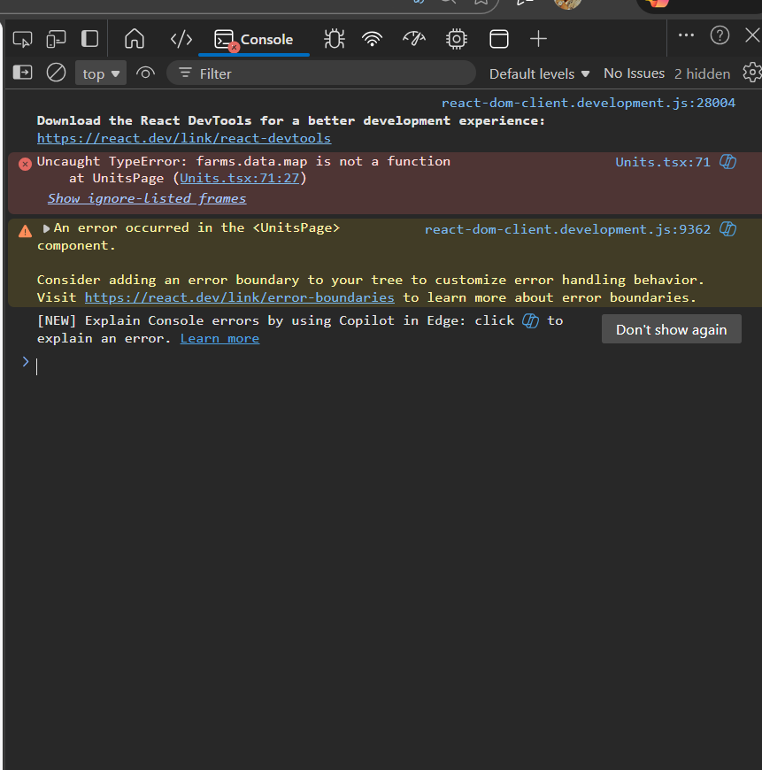

## Plan de développement (élevage) – Mise à jour Phase 2

### 1. Vision produit (élevage uniquement)
Objectif : plateforme de gestion multi-fermes / multi-espèces utilisable sur le terrain, par du personnel non technique, avec traçabilité complète.
Espèces couvertes : volaille (chair, pondeuses), porcin, bovin viande, bovin laitier, autres ruminants (optionnel).

### 2. Architecture technique
Backend : Django + DRF (JWT + RBAC). Frontend : React + Vite (PWA offline). DB : PostgreSQL. Cache/queue : Redis + Celery (à prévoir phase suivante).

### 3. Modèle multi-fermes / multi-espèces (critique)
Entreprise → Fermes → Unités (1 espèce par unité). Exemple : Ferme A avec bâtiment volaille chair, pondeuses, porcherie, étable lait.

### 4. Modules fonctionnels
- Unités d’élevage : capacité, conditions, historique d’occupation.
- Lots / animaux par espèce : entrée, effectif, mortalité, conso aliment, ponte, réformes/sorties.
- Reproduction : insémination/saillie, gestation, mise-bas, performances repro.
- Santé : maladies, vaccins, traitements, ordonnances, quarantaine, alertes (traçabilité obligatoire).
- Alimentation : rations, conso jour/lot, coûts, IC.
- Stocks : aliments, médicaments, matériel, seuils d’alerte, mouvements.
- KPI : mortalité %, GMQ, IC, lait/jour, taux de ponte, rentabilité par lot.
- Finances : coûts (alimentaires, véto), recettes, marge par espèce/ferme.

### 5. UX / UI (terrain-friendly)
1 action = 1 écran, saisie rapide, boutons larges, offline, icônes par espèce. Écrans clés : dashboard ferme, fiche lot, entrée journalière, alertes, résumé mensuel.

### 6. Modèle de données (simplifié)
Enterprise, Farm, Unit, Species, Lot, HealthEvent, Feeding, Stock, FinancialEntry, AuditLog.

### 7. Sécurité / traçabilité
Permissions par ferme, audit des actions, export officiel.

### 8. Mobile / Offline
PWA, sync différée, IndexedDB, gestion de conflits.

### 9. Reporting
Registre sanitaire, registre d’élevage, rapports véto, exports officiels.

### 10. Roadmap
- Phase 1 (MVP volaille/bovin) ✅ : lots, santé, alimentation, dashboard, PWA offline, auth (remplacée par JWT DRF en phase 2), design system.
- Phase 2 (en cours) 🚧 : frontend aligné sur backend Django (JWT) avec routes `/api/auth/login|register|refresh`, données de base seedées (enterprise/farm/species), CRUD minimal fermes/unités/lots opérationnel (création unités + lots depuis UI), liste santé corrigée (params `undefined` retirés), appels sécurisés sur `/api/`.
- Phase 3 (premium) 🔜 : IA prédictive, IoT, mobile native.

### 11. Phase 2 – plan d’action détaillé
1) Auth & config (fait)
	- `VITE_API_BASE_URL` pointé sur `http://127.0.0.1:8000/api/` ; flux JWT DRF (`/auth/login|register|refresh`) opérationnel.
	- Tokens access/refresh stockés côté frontend avec refresh auto.
2) Connexions API métier (fait pour lots/unités, en cours pour stock)
	- Endpoints farms/units/lots/stock alignés DRF avec `Authorization: Bearer <token>`.
	- Health check `/api/health/` vérifié ; bug params `undefined` corrigé pour santé.
3) Données de base (fait)
	- Species de référence (poultry, pig, bovine) + enterprise/farm/unit seedées.
4) Frontend (partiel)
	- Login/Register adaptés JWT.
	- Fermes/listes OK ; création unités et lots disponible depuis UI (formulaires). Stock en lecture + création mouvements à renforcer.
	- Gestion erreurs réseau et loaders en place sur pages principales.
5) QA (en cours)
	- Login/logout/refresh vérifiés manuellement ; tests unitaires santé passent (`SantePage`).
	- À faire : tests UI pour création unités/lots, build frontend (`npm run build`).

### 12. Checklist
✔ Multi-fermes / multi-espèces (modèle) · ✔ PWA offline · ✔ Traçabilité · ✔ Connexion frontend ↔ backend Django (auth + liste) · 🚧 CRUD métier alignés DRF (unités/lots OK, stock à compléter).